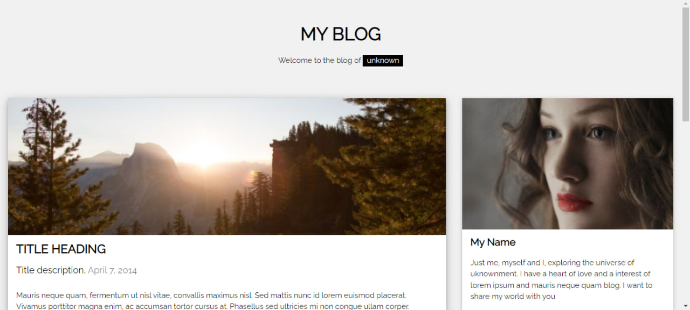

<h1 align="center">Simple Blog Page</h1>

This simple blog project was created using HTML and CSS. The project allows visitors to quickly review content and find the most popular posts. The page design has been created in a minimalist way so that visitors can navigate and access content comfortably.

<h2>🍿 Features </h2>
<ul>   
   <li>Responsive</li>
</ul>

<h2>🍿 Technologies </h2>
<ul>
   <li>HTML</li>
   <li>CSS</Li>
</ul>

<h2>🍿 How to Run the Website on Your System </h2>
<h3> Step 1: Download and Extract the Code </h3>

First, download the entire website code and extract the ZIP file to a folder on your local system.

<h4>Website Code: https://github.com/BilgeGates/Simple-Blog-Page.git</h4>
<h3>Step 2: Launch the website </h3>

You can run it by going to the folder where your code is, and clicking on the index.html file, or you can open it in your code editor and run it in `Live Server`

<h2>🍿 Demo </h2>

 - Check out our live demo at https://trafalgarlanding.netlify.app/ 

